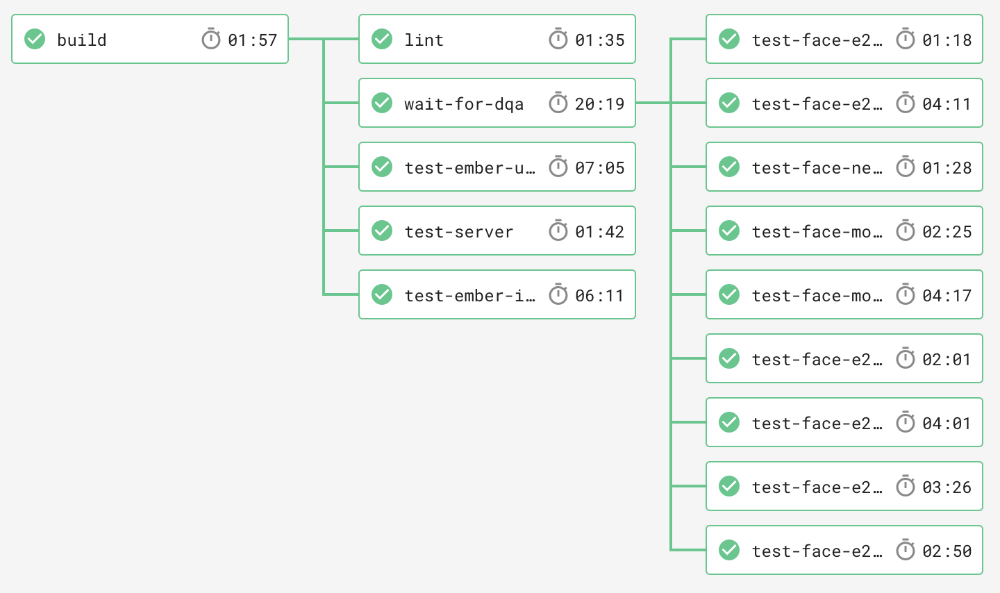

# Continuous Integration

Now, let's setup continuous integration to run our lint commands as tests!
We are going to use [CircleCI](https://circleci.com/), primarily because
[Workflows](https://circleci.com/docs/2.0/workflows/) allow us to create whatever
CI/CD pipeline we want and [Scheduled Workflows](https://circleci.com/docs/2.0/workflows/#scheduling-a-workflow)
allow us to use CircleCI to run our monitors!

Let's start with a simple CircleCI config file. Save the following to [`.circleci/config.yml`](https://circleci.com/docs/2.0/configuration-reference/):

```yaml
version: 2
jobs:
  build:
    docker:
      - image: circleci/node:8
    steps:
      - checkout
      - run: npm install
```

This CircleCI build does the following:

1. Spin up a job using CircleCI's node docker container
1. Check out the git code
1. `npm install`

Read more about caching here: [https://circleci.com/docs/2.0/caching/](https://circleci.com/docs/2.0/caching/)

Let's add our lint commands after `npm install`:

```yaml
- run: npm run eslint
- run: npm run stylelint
```

Now, let's enable CircleCI on your repository:

1. Login to CircleCI via GitHub
1. Click "Add Projects" on the left
1. Find the project and click "Set Up Project"

Your app should start building now!

Next, let's setup the CircleCI Badge on your readme:

1. Go to "builds" on the left
1. Click the gear icon on your project
1. Click "API Permissions"
1. Click "Create Token"
1. Create a token for "Status" - call it something like "Readme Badge"
1. Go to "Status Badges" on the left
1. Select the "master" branch
1. Copy and paste the Markdown embed code into your readme!

## Advanced

There is an art to setting up CircleCI Workflows for your app.
At Dollar Shave Club, we run about 24 jobs for just one repository!
In this workshop, your CircleCI jobs will be slow because we haven't setup caching,
which could be its own lesson.

For a more complex CircleCI config file, checkout [IMS's](https://github.com/jonathanong/ims/blob/master/.circleci/config.yml).

Here is our CircleCI Workflow at DSC:



`dqa` is our version of Heroku's review apps.
