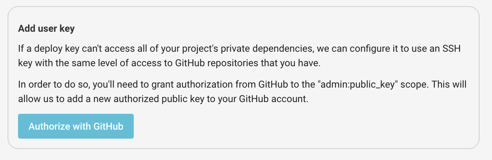
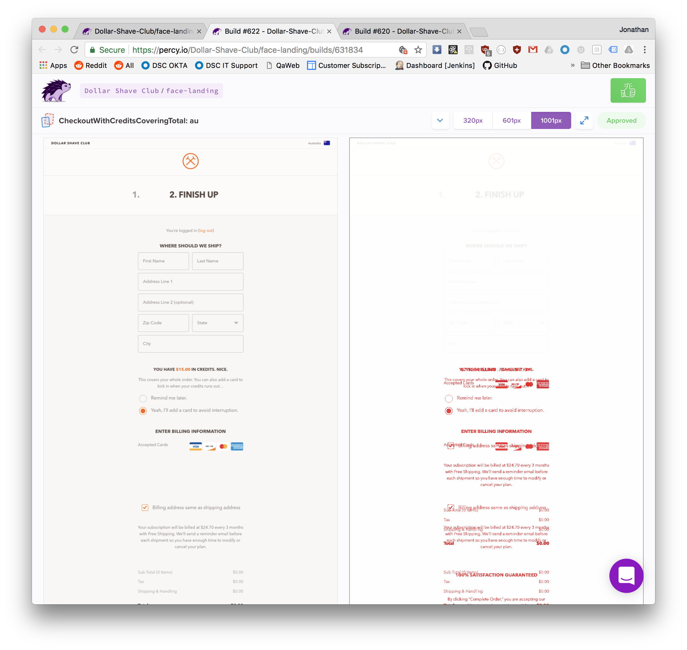

# Storybook

[Storybook](https://storybook.js.org/) is a tool for UI development,
allowing you to build and play with UI components outside of your application.
This makes development in large, complex applications a lot easier and faster
as you don't need to spin up the entire application.

Storybook is already setup for the sample application, although it's easy to setup.
Look at these files and folders:

- `package.json` - all the `@storybook` modules added to `devDependencies` as well as the `scripts` commands
- `.storybook` - the storybook configuration
- `client/ui/` and `client/components/` - the components and styles for storybook (and the application)
- `client/stories/` - the stories for storybook

To build the storybook statically, run `npm run build-storybook`.
However, for development, we just want to run `npm run storybook`.

## Implement Storyshots

Following the [80/20 rule](https://en.wikipedia.org/wiki/Pareto_principle), [Jest snapshots](https://facebook.github.io/jest/docs/en/snapshot-testing.html)
are an easy way to get coverage on your React components without much effort.
[@storybook/addon-storyshots](https://github.com/storybooks/storybook/tree/master/addons/storyshots)
turns your Storybook stories into snapshot tests, killing two birds with one stone.
Now, whenever you write a story for visual testing and component authoring,
you're also writing a snapshot test!

Storyshots is already installed in the example app.
We want to install it by adding the following test at `client/stories/__tests__/index.js`:

```js
import initStoryshots from '@storybook/addon-storyshots'

initStoryshots()
```

Next, let's setup our `jest` tests for the client. Install `jest`:

```bash
npm install --save-dev jest jest-css-modules babel-jest
```

Next, let's add the following `jest` config file at `jest.jsdom.json`:

```json
{
  "collectCoverageFrom": [
    "**/*.js"
  ],
  "coveragePathIgnorePatterns": [
    "/node_modules/",
    "/__tests__/",
    ".css"
  ],
  "roots": [
    "client"
  ],
  "testEnvironment": "jsdom",
  "transform": {
    "\\.css$": "<rootDir>/node_modules/jest-css-modules",
    "\\.js$": "<rootDir>/node_modules/babel-jest"
  },
  "transformIgnorePatterns": [
    "/node_modules/.*\\.js$"
  ]
}
```

You can read more about the configuration here: https://facebook.github.io/jest/docs/en/configuration.html

Next, let's add the test command to `package.json`:

```
"test:jsdom": "jest --config jest.jsdom.json",
```

Now, let's run it!

```bash
npm run test:jsdom
```

And, let's add it to our CircleCI config:

```yaml
- run: npm run test:jsdom
```

### Passing Options

To get code coverage:

```bash
npm run test:jsdom -- --coverage
```

To update snapshots:

```bash
npm run test:jsdom -- --updateSnapshot
```

To run specific tests:

```bash
npm run test:jsdom -- 'client/stories/__tests__/*.js'
```

## Implement storybook-deployer

[@storybook/storybook-deployer](https://github.com/storybooks/storybook-deployer)
is a simple CLI tool to deploy your Storybook to `gh-pages` so that it's viewable publicly. Here's an example [http://airbnb.io/react-dates/](http://airbnb.io/react-dates/).
Let's install it:

```bash
npm install --save-dev @storybook/storybook-deployer
```

We only want to push `master`'s version of storybook to `gh-pages` - we don't want each pull
request pushing its version of storybook to `gh-pages` as it could be a broken version.
To only run it on master, we're going to use [CircleCI 2 Workflows](https://circleci.com/docs/2.0/workflows/).

Let's rename our current `build` job to `test`.
Then create a new job called `publish-storybook`.

```yaml
version: 2
jobs:
  test:
    # ...intentional omission...
  publish-storybook:
    # ...intentional omission...
```

`publish-storybook` should just publish the storybook (copy the test job, but use these `steps` instead):

```yaml
- checkout
- run: npm install
- run: npx storybook-to-ghpages
```

Next, we want to make sure this only runs in production.
We want to publish the storybook after `test` passes and only on master,
so let's create a workflow (append to the bottom of the config file):

```yaml
workflows:
  version: 2
  commit: # this workflow runs on every commit
    jobs:
      - test
      - publish-storybook:
          requires:
            - test
          filters:
            branches:
              only:
                - master
```

To get this working correctly, you'll need to give CircleCI some SSH keys.
Go to your repository's settings, click "Checkout SSH Keys", then
checkout your SSH keys for the repository:



Push and let's see what happens!

## Advanced

- Notice that tests are ran when the storybook is pushed to `gh-pages`, but there are no tests! How can we avoid that from happening?
- Look into implementing addons: [https://storybook.js.org/addons/addon-gallery/](https://storybook.js.org/addons/addon-gallery/)
- Look into continuous visual regression testing: [https://percy.io/](https://percy.io/)


