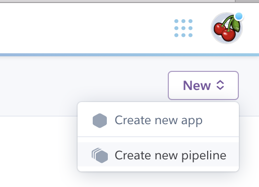
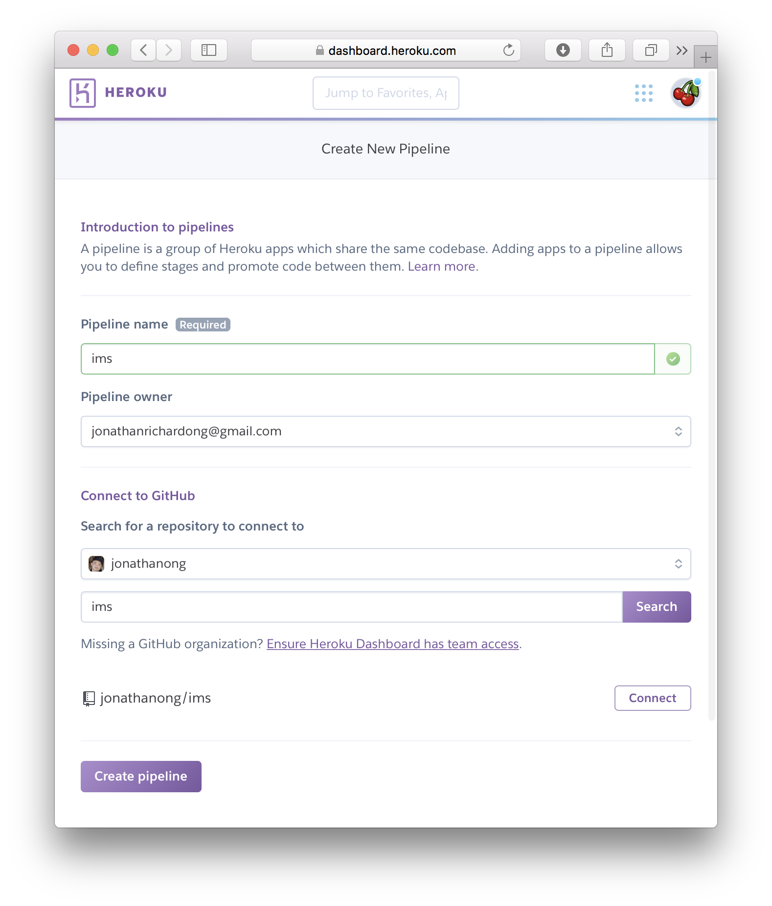
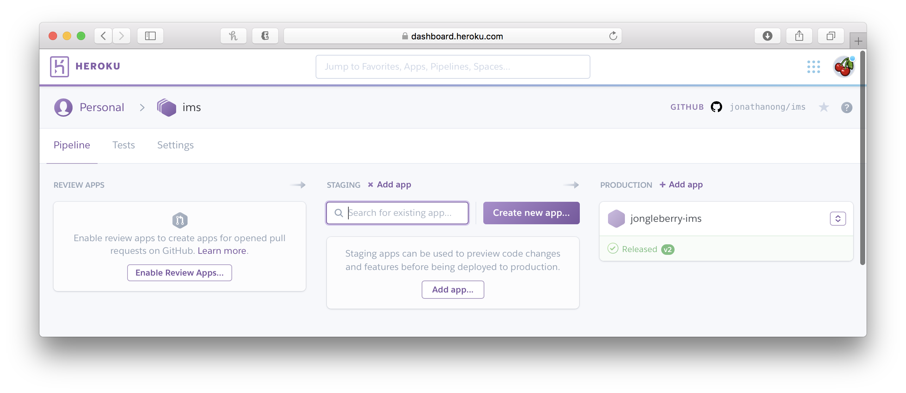
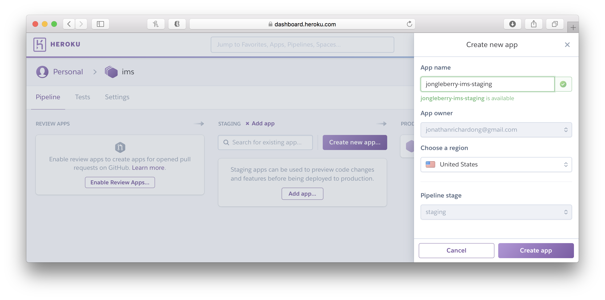
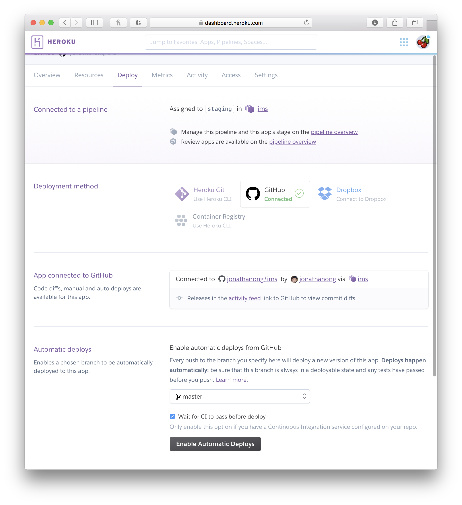
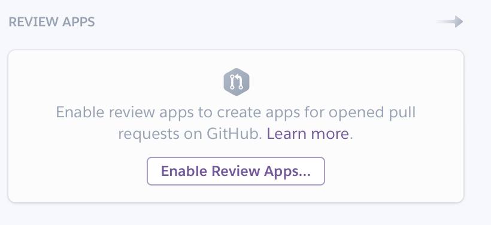
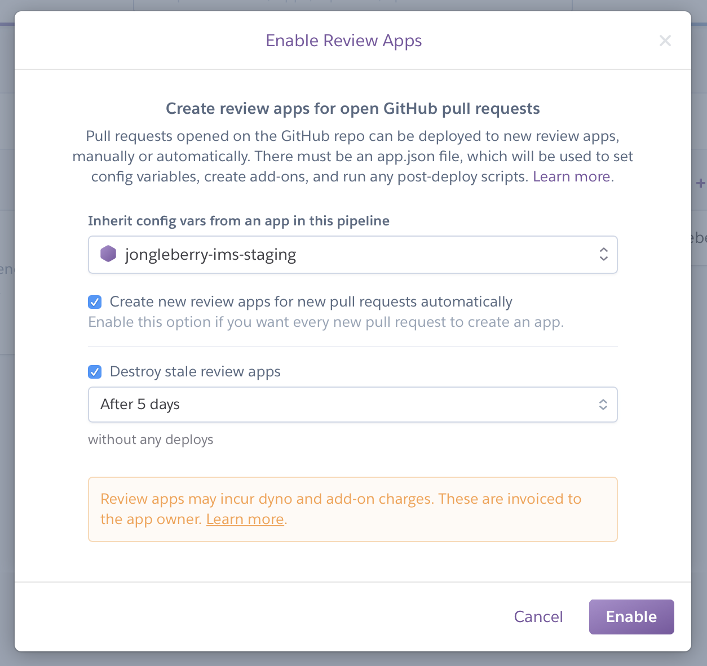
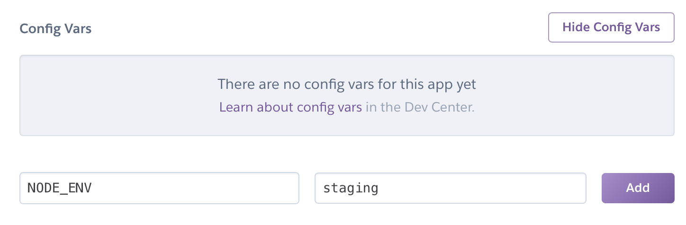

# Continuous Delivery

Next, let's actually deploy our application!
I'm going to assume you have a Heroku account!

## Files

First, we'll need to add a few files.
The first file is a [`Procfile`](https://devcenter.heroku.com/articles/procfile), which tells Heroku how to run your app:

```
web: node server
```

The second is an [`app.json`](https://devcenter.heroku.com/articles/app-json-schema), which tells Heroku how to build your review apps:

```json
{
  "name": "ci-reference-app",
  "env": {
    "NODE_ENV": {
      "value": "staging",
      "required": true
    },
    "HEROKU_REVIEW_APP": {
      "value": "1",
      "required": true
    },
    "HEROKU_APP_NAME": {
      "required": true
    }
  },
  "buildpacks": [
    {
      "url": "https://github.com/heroku/heroku-buildpack-nodejs.git"
    }
  ]
}
```

## Setting It UP

Let's create a new pipeline. Call it whatever you want:





Now, we'll see a page that shows your pipeline.
Read more about Heroku Pipelines here: [https://devcenter.heroku.com/articles/pipelines](https://devcenter.heroku.com/articles/pipelines).
The idea is that once you deploy to staging, you can then instantly deploy to production. No tests need to run, no new container needs to built, nothing.



Let's create your staging and production apps.
Here, I've added `-staging` to my staging app.



Next, let's go to the "Deploy" section of our staging application.
Let's "Enable Automatic Deploys" from the `master` branch,
and also "Wait for CI to pass before deploy".
Now, staging will automatically deploy after your tests pass on `master`!



Next, let's setup our review apps.
Review apps are just apps specifically for your PRs.
This makes QA and testing easier.
You could even run Automation tests against it if you really want!
Read more here: [https://devcenter.heroku.com/articles/github-integration-review-apps](https://devcenter.heroku.com/articles/github-integration-review-apps).





Now, let's push a commit to master and see what happens!
Let's also make a new PR and see what happens!

Be sure to set env vars for each app!

- Production should have `NODE_ENV=production`
- Staging should have `NODE_ENV=staging`



## Advanced

Heroku has a lot of adds that are quite useful.
Perhaps what you might need to debug your app is logging.
If you install the [Heroku Toolbelt](https://devcenter.heroku.com/articles/heroku-cli),
you can view logs by running `heroku logs -a <your-app>` after logging in.
However, a service like [papertrail](https://papertrailapp.com/) might help you a lot.

However, I personally avoid logs. Logging in node.js actually causes significant
performance degradation – you should avoid it as much as possible.
We'll cover error monitoring in a future topic.
