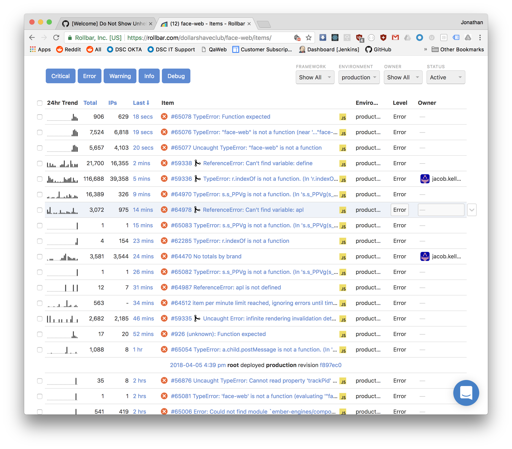

# Error Monitoring

Error monitoring solutions receive your errors via SDKs from either the backend or the frontend,
then organize them in a manner you can understand.
Why use an error monitoring platform?

- Categorize errors in your app
- Know who saw those errors, so you can ask them
- Understand when and with what commit these errors started happening

There are plenty of services, but the one we've used today is [rollbar](http://rollbar.com/).
Here's how our Rollbar dashboard looks like for one of our frontend repositories at Dollar Shave Club:

There are a lot of errors on our app. Ember is not the best framework out there
and we have tons of browser extensions giving us random errors. However,
when you look past all the noise, you may find errors that developers caused
that can actually be fixed!

## Setting Up Rollbar for the Backend

Rollbar is setup without access tokens already due to how complicated the setup is.
You can read about it here: https://rollbar.com/docs/notifier/rollbar.js/

- https://github.com/jonathanong/ci-reference-app/blob/master/server/on-error.js#L5 - first, we've setup a single `on-error` function that all BE errors should eventually be called by
- https://github.com/jonathanong/ci-reference-app/blob/master/server/app.js#L28 - the app passes any errors it receives to this handler
- https://github.com/jonathanong/ci-reference-app/blob/master/server/routes.js#L12 - the error handler propagates errors to the app here

To test this, setup a project in rollbar and hardcode the post server item access token here: https://github.com/jonathanong/ci-reference-app/blob/master/server/on-error.js#L5
Then, add a `throw new Error('boom')` to one of the routes and hit it.

## Setting Up Rollbar for the Frontend

We've also setup the Rollbar implementation for the Frontend for you.
Add the client post item access token here: https://github.com/jonathanong/ci-reference-app/blob/master/server/render.js#L29-L37
That token gets passed to the `pug` file that renders the HTML file: https://github.com/jonathanong/ci-reference-app/blob/master/server/index.pug#L10

To test it, run `Rollbar.error(new Error('boom'))` in your browser console.

## Advanced

Rollbar has many features to help you categorize your errors.
If you look at the screenshot above, you'll notice that you can see when new code was deployed
in the Rollbar timeline. Errors are also grouped by deploys!
