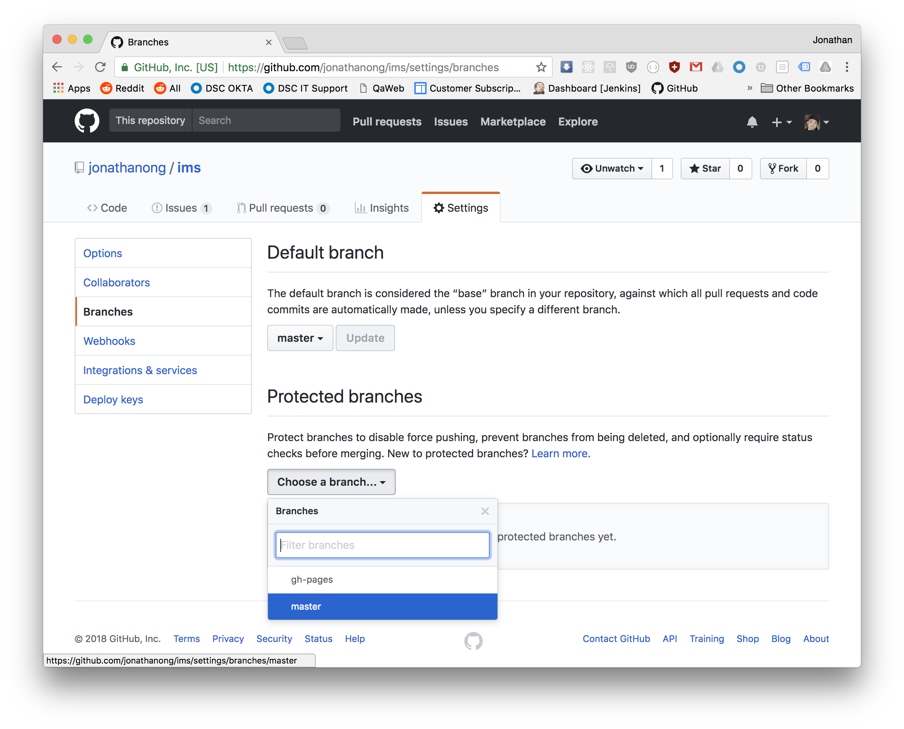
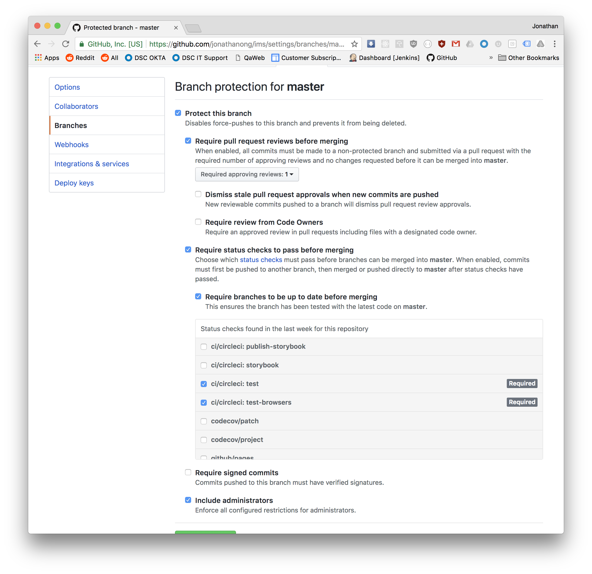

# GitHub Status Checks

Now that you have a CI/CD pipeline setup for your app,
you want to enforce it. No code should ever make it to master that breaks
your CI/CD pipeline.

Let's go to our repo's settings page for branches and make `master` a protected branch:

Let's go to the settings for that branch and require pull request reviews,
require branches to be up to date, and require status checks.

You now have a robust development workflow!
